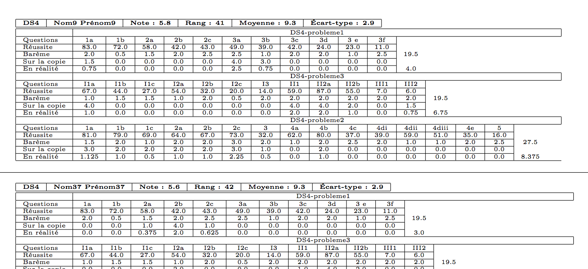
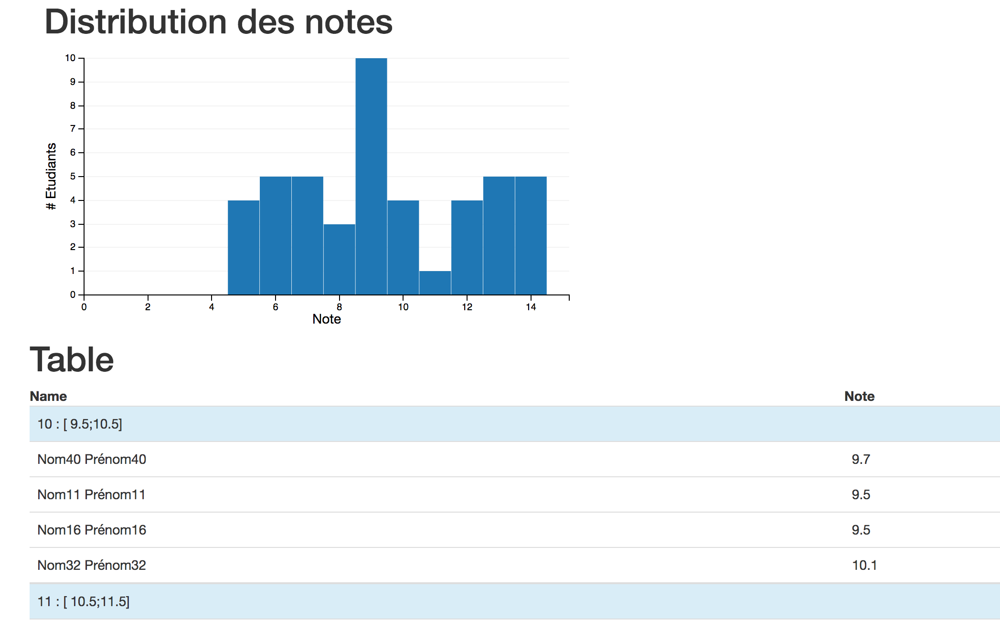

SaKKe  :gift:
==============

SaKKe est un utilitaire simple de génération de statistiques personnalisées de devoirs.

Installation
-------------

.. code-block:: bash

  [sudo] pip install -U sakke [--user]

Usage et hypothèses
----------------------

Afficher l'aide :

.. code-block:: bash

  sakke --help

Les questions des exercices sont notées par défaut sur 4.
Un fichier de barème ajuste la note finale.

.. code-block:: bash

  sakke exercice_1 exercice_2 ...

`exercice_n` est un fichier csv comprenant 2 parties : le barème et les résultats par élèves.
Il est exporté en respectant le format du fichier `ods` donnée en `exemple <https://github.com/msimonin/sakke/blob/master/exemple.ods?raw=true>`_.

Un exemple
----------

* Télécharger le fichier d'exemple
* Exporter chacune des feuilles `problème 1`, `problème 2`, `problème 3` en csv respectivement en les fichiers
  `pb1.csv`, `pb2.csv`, `pb3.csv`
* Générer les fiches individuelles :

.. code-block:: bash

  sakke --name=Exemple pb1.csv pb2.csv pb2.csv
  pdflatex out.tex
  <open> out.pdf

Sortie
-------

* Un fichier  :code:`out.tex` compilable avec pdflatex.

* Un fichier  :code:`out.html` ouvrable avec un navigateur (décent)

