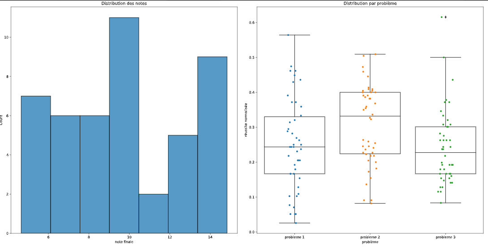

SaKKe  :gift:
==============

SaKKe est un utilitaire simple de génération de statistiques personnalisées de devoirs.

Installation
-------------

.. code-block:: bash

  [sudo] pip install -U sakke [--user]

> Exemple: installation en mode administrateur (installe le programme globalement dans le système) 

    .. code-block:: bash
  
      sudo pip install -U sakke

> Exemple: installation en mode utilisateur (install le programme dans le répertoire personnel)

    .. code-block:: bash
  
      pip install -U sakke --user

   Dans ce mode il faut d'assurer que le programme pourra être trouvé par le shell:
   
    .. code-block:: bash
  
      export PATH=$PATH:~/.local/bin/
   
    

Usage et hypothèses
----------------------

Afficher l'aide :

.. code-block:: bash

  sakke --help

Les questions des exercices sont notées par défaut sur 4.
Un barème ajuste la note finale.

.. code-block:: bash

  sakke DS.ods

Un exemple
----------

* Télécharger le fichier d'exemple
* Générer les fiches individuelles :

.. code-block:: bash

  sakke exemple.ods
  pdflatex out.tex
  <open> out.pdf

Sortie
-------

* Un fichier  :code:`out.tex` compilable avec pdflatex.

.. image:: pdf.png

* Un fichier avec quelques graphiques:

